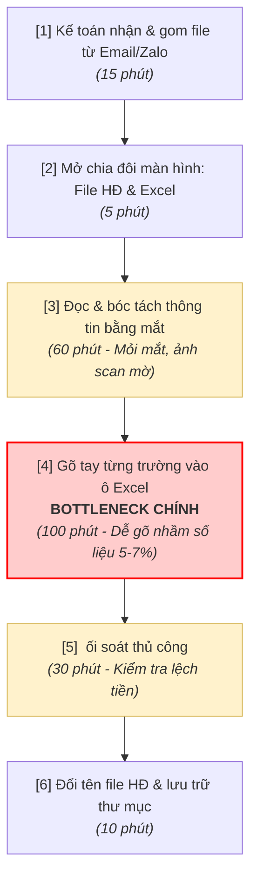
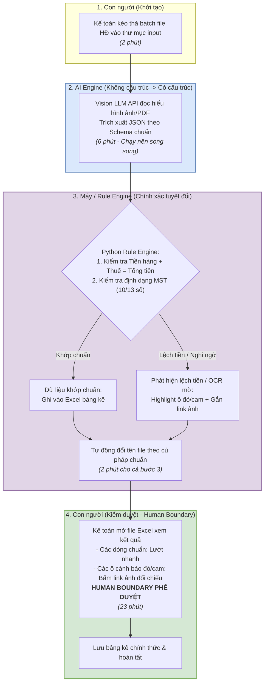

# Sơ đồ Workflow: Trích xuất hóa đơn tự động điền Excel cho Kế toán

> Tài liệu đính kèm minh họa luồng công việc Trước (Current State) và Sau (Future State) của nhóm cho bài toán xử lý hóa đơn kế toán.

---

## 1. Current State Workflow (Hiện tại — 220 phút / 60 hóa đơn)

*Điểm nghẽn chính:* Bước 4 (gõ tay thủ công) và bước 3 (đọc mắt ảnh mờ) chiếm 72% tổng thời gian (160/220 phút), gây mệt mỏi và rủi ro sai lệch dữ liệu thuế.

---

## 2. Future State Workflow (Tương lai — 35 phút / 60 hóa đơn)

---

## 3. So sánh các chỉ số vận hành (Impact Summary)

| Chỉ số | Trước cải tiến | Sau cải tiến (Kỳ vọng) | Mức cải thiện |
|---|---|---|---|
| **Tổng thời gian xử lý** | 220 phút / batch 60 HĐ | 35 phút / batch 60 HĐ | **Giảm 84%** (Tiết kiệm >3 giờ/ngày) |
| **Thao tác thủ công** | 6 bước thủ công | 2 bước (Nạp file & Duyệt kết quả) | Tự động hóa 66% số bước |
| **Tỷ lệ sai sót số học** | 5–7% do gõ nhầm | **0%** | Nhờ Rule Engine kiểm tra số học trước khi xuất file |
| **Rủi ro vận hành** | Kế toán mệt mỏi, trễ hạn báo cáo | Kế toán chủ quan duyệt lướt | Được khắc phục bằng cơ chế highlight cảnh báo bắt buộc |
